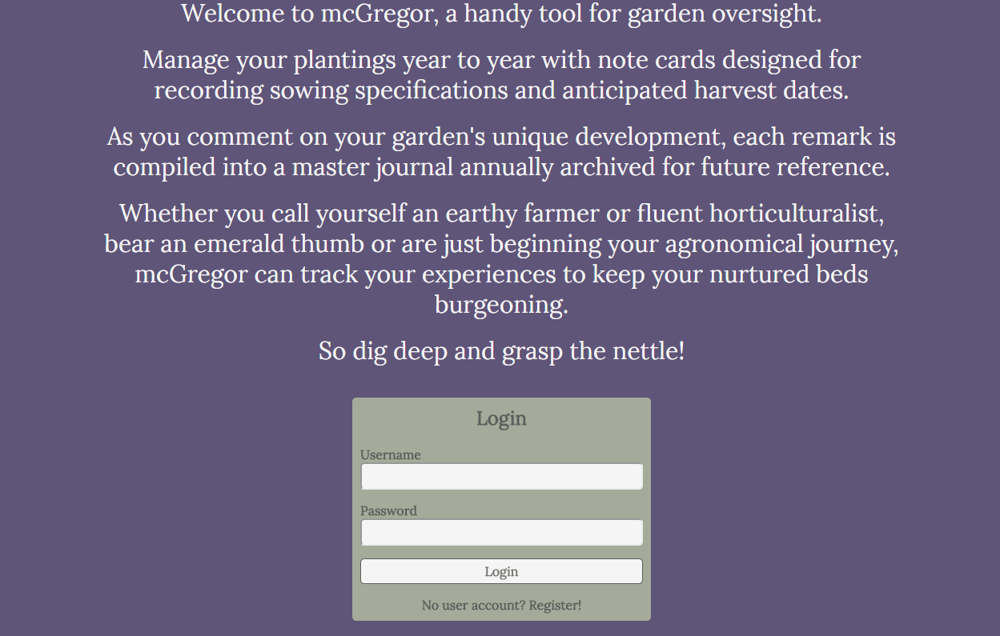
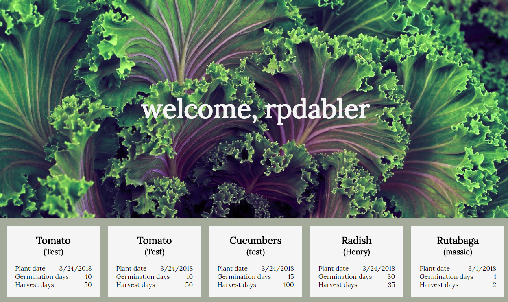
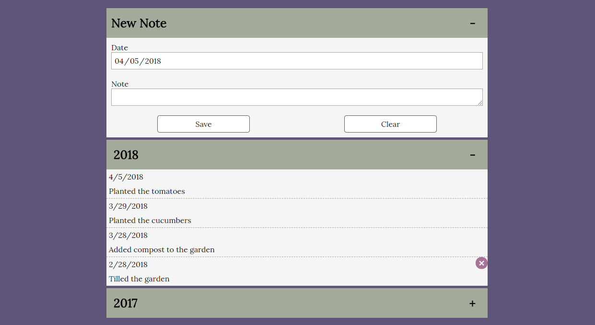

# mcGregor

McGregor is a garden management tool, allowing you to track your current plantings for the year.  You have the ability to create crops and put in relevant growing/planting information (usually based off the seed packet) as well as write notes involving important events about your garden (e.g., fertilizing, spraying, weeding, watering).

## Technology

This project is built using React, HTML, and CSS for the front-end.  The server is a Node Express app using Mongoose as the go-between for a Mongo database.

## Screenshots

Front page

Description and login form

Welcome user screen and garden plots

Notes section
